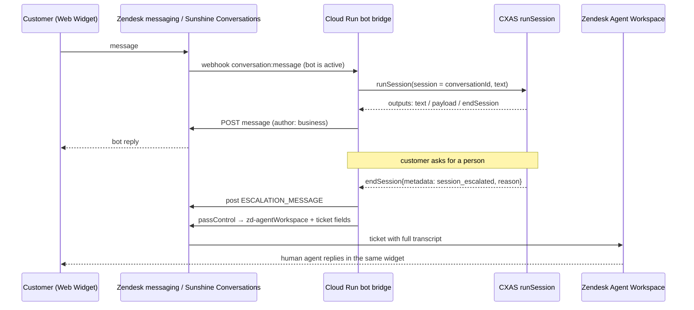

# Escalating from a CXAS chatbot to a human agent in Zendesk

Status: proposal · Date: 2026-10-08

## Goal

A customer opens chat on our website or in our Android or iOS app. A Google Customer Experience
Agent Studio (CXAS) agent answers first. If the customer asks for a person, the
conversation moves to a human agent in Zendesk, with the bot transcript and
context carried over, and without the customer having to start again.

## TL;DR

- **A Zendesk Support app cannot be the customer-facing chat button.** Support
  apps (Zendesk Apps Framework, ZAF) only run inside the Zendesk agent
  interface. The UJET sample is exactly that: an *agent-side* app.
- **Keep the rest of the initial idea**: a Cloud Run backend that calls CXAS
  and escalates when CXAS returns `endSession` with escalation metadata.
- **Recommended:** use the **Zendesk Web Widget (messaging)** as the chat
  button, and plug the Cloud Run backend into Zendesk's conversation
  **switchboard** as a custom bot. On escalation the backend calls
  `passControl` to `zd-agentWorkspace`; the same conversation, with full
  history, lands in the agent's queue as a ticket.
- **Mobile apps get the same flow** by embedding the Zendesk messaging SDKs for
  Android and iOS. They use the same messaging backend and switchboard as the
  Web Widget, so the same bot, handoff and agent queue apply without extra
  backend work (see [Mobile apps](#mobile-apps-android-and-ios)).
- **Optionally add a Support app** (ticket sidebar) for agents, showing CXAS
  context such as escalation reason, summary and session id. This is where the
  UJET pattern is genuinely useful.

## What the UJET sample actually is

`ujet-zendesk-chat-v1.3.zip` is a ZAF v2 app:

| File | What it does |
| --- | --- |
| `manifest.json` | Declares `location.support.top_bar` and `location.support.background`, plus settings `subdomain` and `ujetDomainName`. |
| `assets/loader.html` | Background script that finds the top-bar instance and calls `preloadPane`, so the panel is ready when the agent opens it. |
| `assets/iframe.html` | Top-bar pane that embeds `https://{subdomain}.{ujetDomainName}/?…&type=chat&from=zendesk` in an iframe and **proxies ZAF client calls over `postMessage`**: the UJET page sends `{index, method, args}`, the app runs `client[method](...args)` and posts back the result. Origin is checked against the UJET host. |
| `assets/redirect.html` | Same URL, but a full-page redirect instead of an iframe. |

So UJET (now Google CCAI Platform) puts its **agent adapter** inside Zendesk and
lets it read and write Zendesk data (tickets, users) through the ZAF client.
The customer never sees this app. The customer-facing chat is UJET's own web
SDK, and routing to humans is done by the UJET/CCAI Platform contact center,
not by Zendesk.

Two takeaways for us:

1. The customer-side piece has to come from somewhere else (Zendesk Web Widget
   or our own widget).
2. The iframe-plus-`postMessage` proxy is a good, reusable pattern if we want an
   agent-side panel that is hosted on Cloud Run but can still call the ZAF API.

## Relevant platform facts

**CXAS** (`ces.googleapis.com`, `projects.locations.apps.sessions:runSession`)

- `RunSessionResponse.outputs[]` is a list of `SessionOutput`. Each has one of
  `text`, `payload`, `toolCalls`, `endSession`, and so on.
- `EndSession` means "the session has terminated, due to either successful
  completion … or an agent escalation", and carries an optional `metadata`
  Struct with the reason. After it, the agent processes no more input.
- In the agent, escalation is done with the system tool, e.g.
  `end_session(reason="Billing issue", session_escalated=True, params={...})`.
  `params` can hold `ESCALATION_MESSAGE` (text to show the customer) and
  `LIVE_AGENT_HANDOFF` options.
- Telling "goodbye" from "escalate" therefore means reading
  `endSession.metadata` (for example `session_escalated`).

**Zendesk messaging** (Web Widget plus Sunshine Conversations)

- Every messaging conversation has a **switchboard** that decides which
  integration is in control: a bot or `zd-agentWorkspace` (human agents).
- A custom bot is a webhook integration registered as a switchboard
  integration. Only the active integration gets message webhooks by default.
- The bot hands over with `passControl` to `zd-agentWorkspace` (or `next`).
  This creates or makes eligible a ticket, and history is injected into the
  ticket. Metadata on `passControl` can set ticket fields
  (`dataCapture.ticketField.<id>`, `dataCapture.systemField.<name>`) and
  `first_message_id`.
- When the agent solves the ticket, control is released, and the next customer
  interaction starts with the default integration (our bot) again.

## Options

### Option A (recommended): Zendesk Web Widget + switchboard bot on Cloud Run

How it works:

1. Embed the standard Zendesk Web Widget (messaging) snippet on the site. That
   is the chat button. Turn off Zendesk's own AI agent as first responder.
2. Create a Sunshine Conversations webhook integration pointing at Cloud Run,
   register it as a switchboard integration, make it the default, and set its
   next integration to `zd-agentWorkspace`.
3. Cloud Run receives `conversation:message` webhooks, ignores anything not
   authored by the user, and calls CXAS `runSession`, using the Zendesk
   conversation id as the CXAS session id (no extra mapping store needed).
4. It turns `text` and `payload` outputs into Sunshine Conversations messages
   (text, quick replies, carousels) posted as the business.
5. On `endSession`:
   - escalation (`session_escalated` true): post the `ESCALATION_MESSAGE`, then
     `passControl` to `zd-agentWorkspace`, with metadata such as
     `dataCapture.ticketField.<cxas_session_id>`, the escalation reason, and an
     optional bot summary for a ticket field;
   - normal end: post the closing message and leave control with the bot.

Pros:

- The customer stays in one widget, and the human sees the whole bot transcript
  in the ticket with no copying.
- Zendesk does routing, queues, SLAs, business hours, offline fallback,
  attachments, notifications and reconnects.
- Our code is small: one stateless Cloud Run service.
- This is the officially supported way to put a third-party bot in front of
  Zendesk agents.

Cons and things to check:

- Needs Sunshine Conversations API access and switchboard configuration on the
  Zendesk plan. **Confirm the plan and any Sunshine Conversations add-on before
  building.**
- Widget look and feel is limited to what Zendesk lets us style.
- Webhooks can be retried: dedupe on message id, and answer the webhook fast,
  doing CXAS work asynchronously (for example via Cloud Tasks) if CXAS latency
  is a concern.
- Rich CXAS output (`payload`) needs a mapping to Sunshine message types.

### Option B: Our own chat widget + Sunshine Conversations as the agent channel

Build our own chat UI (or reuse a CXAS web front end). The Cloud Run backend
talks to CXAS while the bot is in charge. On escalation it creates a Sunshine
Conversations user and conversation, posts the transcript, and does
`passControl`. After that it relays messages both ways: customer messages are
posted to Sunshine, and agent replies arrive by webhook and are pushed to the
browser over WebSocket or SSE.

- **Pros:** full control of the UI. The handoff is still in one window.
- **Cons:** we own realtime delivery, reconnects, typing indicators,
  attachments, read receipts, authentication and offline handling, all of which
  Option A gets for free. Same Zendesk plan requirement as A.
- **Pick it if** the branded UI or embedding in an existing app is a hard
  requirement.

### Option C: CXAS widget first, then open the Zendesk widget on escalation

A CXAS-only widget handles the bot phase. On escalation the page hides it and
opens the Zendesk Web Widget, passing context with conversation fields or
metadata.

- **Pros:** cheapest to start. No switchboard work.
- **Cons:** the customer sees two different widgets, and the bot transcript
  does not land in the conversation naturally (it has to be pushed as fields, an
  internal note, or a first message). The seam shows.
- **Pick it for** a quick proof of concept only.

### Option D: Asynchronous escalation to a ticket

On escalation, Cloud Run creates a Zendesk ticket through the Support API, with
the transcript as the first comment, and tells the customer to expect an email.

- **Pros:** trivial, and works on any plan.
- **Cons:** not live chat.
- **Use it as** the out-of-hours fallback in any of the options above.

### Option E: Google CCAI Platform (ex-UJET) as the contact center

Use CCAI Platform's chat SDK with CXAS as its virtual agent. Human agents work
in the CCAI Platform adapter inside Zendesk, which is the app in the zip.

- **Pros:** native CXAS-to-human handoff, plus voice, and Zendesk as the CRM.
- **Cons:** a second platform to license and run. Routing lives in CCAI
  Platform, not in Zendesk.
- **Pick it if** the organisation is adopting CCAI Platform anyway.

### The original idea: a Zendesk Support app as the chat button

ZAF apps can only load in Zendesk product locations, such as `top_bar`,
`ticket_sidebar`, `nav_bar` and `background` for Support. They need an
authenticated agent session and the ZAF client, so they cannot be embedded on a
public website. The UJET manifest confirms it: it only declares
`support.top_bar` and `support.background`. The Cloud Run plus CXAS plus
`endSession` part of the idea is sound and carries over unchanged into Option
A. Only the customer-facing surface changes.

## Comparison

| | A. Web Widget + switchboard | B. Own widget + Sunshine | C. Two widgets | D. Ticket only | E. CCAI Platform |
| --- | --- | --- | --- | --- | --- |
| Customer experience | One widget, seamless | One widget, seamless | Visible switch | Async email | One widget, seamless |
| Transcript in Zendesk | Native | Native | Manual | Ticket comment | Via adapter |
| Build effort | Low to medium | High | Low | Very low | Medium (platform setup) |
| Zendesk requirements | Messaging + Sunshine API | Messaging + Sunshine API | Messaging | Any | Any plus CCAI license |
| UI control | Limited | Full | Partial | n/a | CCAI SDK |

## Recommendation

Go with **Option A**, with **D as the out-of-hours fallback**. Optionally add
an agent-side **Support app** (ticket sidebar) that reads the CXAS session id
from a ticket field and shows the escalation reason, a bot summary, and the
variables collected. That app can reuse the UJET iframe and `postMessage`
proxy pattern if its UI is hosted on Cloud Run.

## Mobile apps (Android and iOS)

Requirement: the same chat experience inside our native apps.

Zendesk ships messaging SDKs for Android and iOS. They are the native
counterparts of the Web Widget: each app is another channel of the same
Sunshine Conversations app, so its conversations go through the same
switchboard. With the bot set as the switchboard's default responder, a chat
started in the app is answered by the same Cloud Run bridge and CXAS agent. It
escalates with the same `passControl` to the same Agent Workspace queue. **The
bridge needs no per-platform code.**

What the apps need:

- **The SDK:** embed the Zendesk messaging SDK, initialised with the channel key
  from Admin Center (one channel per app).
- **Push notifications:** configure FCM (Android) and APNs (iOS) in Admin
  Center, so customers get agent replies after they leave the chat screen.
  This matters more on mobile, because the wait for a human can be long.
- **Signed-in users:** use JWT authentication in the SDKs and in the Web
  Widget, so the same customer sees one conversation history on web and mobile,
  and the ticket is attached to a known Zendesk user.

Rich content support differs by surface (from Zendesk's
[Web Widget and SDK capabilities](https://developer.zendesk.com/documentation/zendesk-web-widget-sdks/capabilities/)):

| | Web Widget | Android SDK | iOS SDK |
| --- | --- | --- | --- |
| Quick replies | Yes | Yes | Yes |
| Postback buttons | No | Yes | Yes |
| Carousel | Yes (3 buttons per item) | Yes (3 buttons per item) | Yes (3 buttons per item) |
| Max buttons on a text message | 10 | 1 | 10 |
| Push notifications | n/a | Yes | Yes |

Design rule for the CXAS agent: use **quick replies** for choices, because
they work everywhere, and avoid postback buttons. If an answer really needs a
richer format, the bridge can send the customer's channel (`web`, `android`,
`ios`) to CXAS as a session variable, and the agent can branch on it
(`CES_CHANNEL_VARIABLE` in the bridge).

The alternative of building our own native chat UI (as in Option B) would mean
rebuilding realtime messaging, push and offline handling twice. That strengthens
the case for Option A.

## Proposed components

- `bridge/` is the Cloud Run service. It verifies the Sunshine webhook
  signature or key, calls CXAS `runSession`, maps outputs to messages, and
  calls `passControl` on escalation. It runs as a service account with the CES
  client role. Secrets live in Secret Manager.
- **CXAS app** escalates through `end_session(session_escalated=True,
  reason=..., params={ESCALATION_MESSAGE: ...})`, optionally setting a summary
  variable.
- **Zendesk configuration**: messaging Web Widget, the Sunshine Conversations
  webhook integration plus switchboard integration (default, next =
  `zd-agentWorkspace`), and custom ticket fields for the CXAS session id and
  escalation reason.
- **Mobile apps**: the Zendesk messaging SDK for Android and iOS, with push
  (FCM and APNs) configured in Admin Center.
- `zendesk-app/` (optional) is the ticket sidebar app for agents.

## Open questions to settle in a spike

1. Which Zendesk plan we are on, and whether Sunshine Conversations API and
   switchboard access are included.
2. The exact `endSession.metadata` shape our CXAS app emits for
   `session_escalated` versus a normal goodbye. Capture a real response.
3. Whether `runSession` per message is fast enough for the chat feel, or
   whether we need `streamRunSession` plus progress or typing indicators.
4. Customer identity: anonymous widget users, or authenticated messaging (JWT)
   so the ticket attaches to a known Zendesk user.
5. Data handling: transcript retention in both Google Cloud and Zendesk, and
   any PII redaction before the handoff.

## Sources

- [CX Agent Studio handoff](https://docs.cloud.google.com/agent-assist/docs/handoff-cxas)
- [CES `RunSessionResponse` reference](https://docs.cloud.google.com/customer-engagement-ai/conversational-agents/ps/reference/rest/v1beta/RunSessionResponse)
- [Zendesk switchboard (programmable conversations)](https://developer.zendesk.com/documentation/conversations/messaging-platform/programmable-conversations/switchboard/)
- [About Sunshine Conversations in Zendesk Suite](https://support.zendesk.com/hc/en-us/articles/5514406080538-About-Sunshine-Conversations-in-Zendesk-Suite)
- UJET Chat Zendesk app v1.3 (uploaded sample)
